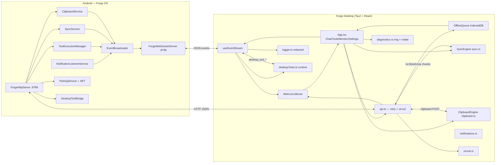

# Forge Desktop — Architecture

## Component responsibilities

| Component | Responsibility |
|---|---|
| `EventStreamClient` (TS) | WS lifecycle, backoff reconnect, resubscribe, msg emit |
| `useEventStream` (TS) | App-facing state: notifications, tool activity, agent typing, config merges |
| `api.ts` | All HTTP; token rotation (401), network retry (backoff), circuit gate, usage accounting |
| `forge_request` (Rust) | Binary-safe proxy: raw TCP, byte-searched headers, Content-Length always set |
| `ToolExecutionManager` (Kotlin) | Async op registry, progress, real Job cancellation |
| `EventBroadcaster` (Kotlin) | 1000-entry queue, type-filtered WS fan-out |
| `SyncService` (Kotlin) | Chunk reassembly, whole-file SHA-256, gzip decompress, `file_modified` events |
| `sync.rs` | Watcher (500ms debounce), chunked upload, range download, `sync_auto` conflicts |
| `PairingService` (Kotlin) | 6-digit codes (5 min), HS256 JWT 1y, token get/save/revoke |
| `MetricsCollector` (TS) | Per-tool perf, per-feature data usage, CSV |
| `Overlay kill-switches` | // placeholder removed |

## Data flows

1. **Tool call**: UI → `callTool` → `POST /api/tool` → `{opId}` → poll status (or WS progress) → metrics recorded.
2. **Notification**: NLService → EventBroadcaster → WS `notification` → panel + native toast; action click → `POST /api/notification/action` → PendingIntent.
3. **File sync**: watcher → debounce → `sync_upload_file` chunks (+gzip flag) → SyncService reassemble → verify → write → `file_modified` event → desktop mirrors.
4. **Config**: SettingsPanel → `POST /api/config`; device changes → `config_changed` → server-wins merge.

## Security

- Tokens: OS keychain (keyring) on desktop; Android Keystore / SecureKeyStore on device.
- Requests: Bearer JWT (HS256, `iss=forge-os`, 1y) — three-way auth check (API key / stored token / JWT).
- Logs: token/password/api-key values redacted via regex before persistence.
- Diagnostics export redacts tokens before download.

## Tech stack

Android: Kotlin, Ktor-style raw ServerSocket HTTP, java-websocket, java-jwt, Hilt.
Desktop: Tauri 2 + React 18 + TypeScript, Rust (tokio, notify, sha2, flate2, arboard,
aes-gcm, rfd), Tailwind. Zero new runtime npm deps for tasks 14–19 (logs/CSV/queue are
hand-rolled over browser APIs / IndexedDB).